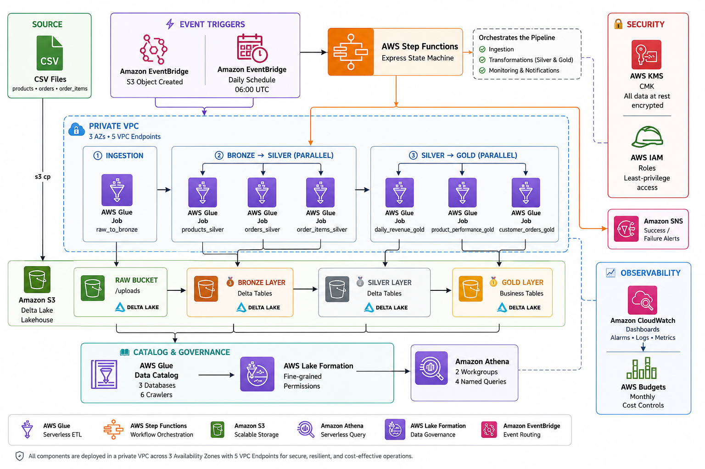
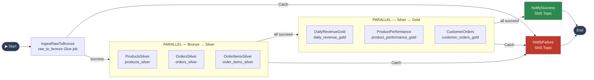

# E-Commerce Data Lakehouse on AWS

    

A production-grade **Lakehouse** for an e-commerce platform on AWS. Raw transactional CSVs land in S3, flow through a **Bronze → Silver → Gold** medallion pipeline powered by Delta Lake on AWS Glue, and surface as analytics-ready tables in Amazon Athena. The entire stack is provisioned with Terraform (10 modules) and deployed via GitHub Actions CI/CD.


## Architecture

### High-Level Data Flow



> All components run inside a private VPC across 3 Availability Zones with 5 VPC Endpoints for secure, resilient, and cost-effective operations.

---

### Step Functions Pipeline



> Every stage has exponential-backoff retries and a `Catch` block that routes failures to the SNS failure topic.

---

## Medallion Layers

| Layer | S3 Prefix | Format | Description |
|---|---|---|---|
| **Bronze** | `lakehouse/bronze/` | Delta Lake | Raw CSV replicated as-is; system metadata columns appended |
| **Silver** | `lakehouse/silver/` | Delta Lake | Typed, cleansed, deduplicated; SCD Type 2 for products dimension |
| **Gold** | `lakehouse/gold/` | Delta Lake | Business KPIs: daily revenue, product performance, customer LTV |

---

## AWS Services

| Category | Service | Purpose |
|---|---|---|
| Compute | AWS Glue 4.0 (PySpark 3.3) | ETL across all three medallion layers |
| Orchestration | AWS Step Functions (Express) | Pipeline control flow with retries and error routing |
| Storage | Amazon S3 (4 buckets) | Raw, lakehouse, Glue assets, Athena results |
| Storage | Delta Lake | ACID tables with time-travel and schema enforcement |
| Catalog | AWS Glue Data Catalog | Schema registry — 3 databases, 6 crawlers |
| Governance | AWS Lake Formation | Fine-grained table and column permissions |
| Query | Amazon Athena | Interactive SQL on Silver & Gold layers |
| Networking | Amazon VPC | Private subnets across 3 AZs; no internet egress |
| Networking | VPC Endpoints | Private access to S3, Glue, KMS, CloudWatch, Step Functions |
| Security | AWS KMS | Customer-managed key (CMK) for all data at rest |
| Security | AWS IAM | Least-privilege roles: Glue execution, crawlers, Step Functions, LF |
| Triggers | Amazon EventBridge | Daily cron (06:00 UTC) + S3 Object Created event |
| Alerting | Amazon SNS | Success and failure pipeline notifications |
| Monitoring | Amazon CloudWatch | Logs, metric alarms, operational dashboards |
| Cost | AWS Budgets | Monthly spend limit with threshold alerts |

---

## Quick Start

```bash
# 1. Bootstrap remote state
ACCOUNT_ID=$(aws sts get-caller-identity --query Account --output text)

aws s3api create-bucket \
  --bucket "ecom-lakehouse-tfstate-${ACCOUNT_ID}" \
  --region us-east-1

aws dynamodb create-table \
  --table-name ecom-lakehouse-tfstate-locks \
  --attribute-definitions AttributeName=LockID,AttributeType=S \
  --key-schema AttributeName=LockID,KeyType=HASH \
  --billing-mode PAY_PER_REQUEST \
  --region us-east-1

# 2. Deploy infrastructure (all 10 modules)
cd terraform
terraform init \
  -backend-config="bucket=ecom-lakehouse-tfstate-${ACCOUNT_ID}" \
  -backend-config="key=lakehouse/terraform.tfstate" \
  -backend-config="region=us-east-1"

terraform apply \
  -var="aws_account_id=${ACCOUNT_ID}" \
  -var="sns_alert_email=your@email.com"

# 3. Upload Glue scripts
aws s3 cp glue_scripts/ \
  s3://ecom-lakehouse-glue-assets-${ACCOUNT_ID}/scripts/ --recursive

# 4. Drop source data to trigger the pipeline
aws s3 cp data/ \
  s3://ecom-lakehouse-raw-${ACCOUNT_ID}/uploads/ --recursive
```

See [Deployment](docs/deployment.md) for the full step-by-step guide, prerequisite checklist, and teardown instructions.

---

## Project Structure

```
AWSProject2/
├── docs/                              # All project documentation
│   ├── architecture.md
│   ├── data-sources-and-schemas.md
│   ├── glue-scripts.md
│   ├── terraform-modules.md
│   ├── deployment.md
│   ├── cicd.md
│   ├── security.md
│   ├── monitoring.md
│   ├── athena-queries.md
│   └── deliverables.md
├── terraform/
│   ├── main.tf                        # Root module wiring all 10 sub-modules
│   ├── backend.tf                     # S3 + DynamoDB remote state
│   ├── variables.tf
│   ├── terraform.tfvars.example
│   └── modules/
│       ├── vpc/                       # VPC, subnets, VPC endpoints, security groups
│       ├── kms/                       # CMK with service-scoped key policy
│       ├── storage/                   # 4 S3 buckets with lifecycle policies
│       ├── iam/                       # Glue, crawler, Step Functions, LF roles
│       ├── glue/                      # Catalog databases, crawlers, Glue 4.0 jobs
│       ├── lake_formation/            # LF settings, S3 location, permissions
│       ├── step_functions/            # Express state machine, SNS, CloudWatch Logs
│       ├── eventbridge/               # Daily cron + S3-event rules
│       ├── athena/                    # Workgroups and named queries
│       └── monitoring/                # CloudWatch alarms, dashboards, Budgets
└── glue_scripts/
    ├── utils/
    │   └── delta_utils.py             # Shared Delta Lake PySpark helpers
    ├── ingestion/
    │   └── raw_to_bronze.py           # CSV → Bronze with Glue bookmarks
    ├── bronze_to_silver/
    │   ├── products_silver.py         # SCD Type 2 product dimension
    │   ├── orders_silver.py           # Dedup + type casting
    │   └── order_items_silver.py      # Data quality checks
    └── silver_to_gold/
        ├── daily_revenue_gold.py      # Daily revenue KPIs
        ├── product_performance_gold.py# Product-level performance metrics
        └── customer_orders_gold.py    # Customer LTV aggregates
```

---

## Documentation

| Doc | Description |
|---|---|
| [Architecture](docs/architecture.md) | System diagram, medallion layers, pipeline flow, AWS services |
| [Data Sources & Schemas](docs/data-sources-and-schemas.md) | Source CSV fields; Bronze, Silver, and Gold table schemas |
| [Glue Scripts](docs/glue-scripts.md) | Per-script breakdown of transformation logic |
| [Terraform Modules](docs/terraform-modules.md) | All 10 modules: VPC, KMS, storage, IAM, Glue, Step Functions, EventBridge, Lake Formation, Athena, monitoring |
| [Deployment](docs/deployment.md) | Prerequisites, step-by-step setup, configuration variables, teardown |
| [CI/CD](docs/cicd.md) | GitHub Actions workflow: lint, test, deploy |
| [Security](docs/security.md) | Encryption, network isolation, IAM, Lake Formation governance |
| [Monitoring & Cost](docs/monitoring.md) | CloudWatch dashboard, alarms, lifecycle policies, cost controls |
| [Athena Queries](docs/athena-queries.md) | Named queries for revenue, product performance, customer LTV, data quality |
| [Deliverables](docs/deliverables.md) | Requirements mapping from the project brief to the implementation |
