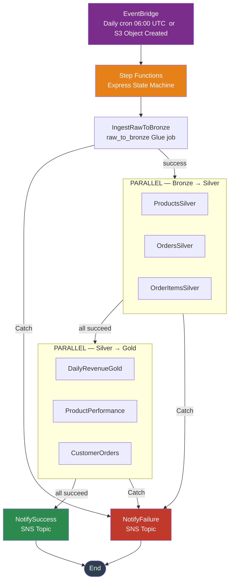

# Architecture

## Overview

The system implements a **medallion architecture** (Bronze → Silver → Gold) on AWS. Raw e-commerce CSVs land in S3, are progressively refined through three Delta Lake layers, and are exposed for SQL analytics via Athena. All compute runs inside a private VPC with no internet egress.

## System Diagram

> All components run inside a private VPC across 3 Availability Zones with 5 VPC Endpoints for secure, resilient, and cost-effective operations.

## Medallion Layers

| Layer | S3 Prefix | Description |
|---|---|---|
| **Bronze** | `s3://lakehouse/bronze/` | Raw CSV data replicated as-is with system metadata columns |
| **Silver** | `s3://lakehouse/silver/` | Cleansed, typed, deduplicated; SCD Type 2 for product dimension |
| **Gold** | `s3://lakehouse/gold/` | Aggregated KPIs: daily revenue, product performance, customer LTV |

## Pipeline Flow

> Every task state has exponential-backoff retries and a `Catch` block routing failures to `NotifyFailure` (SNS). Configurable `HeartbeatSeconds` and `TimeoutSeconds` per state.

## AWS Services

| Category | Service | Purpose |
|---|---|---|
| Compute | AWS Glue 4.0 (PySpark 3.3) | ETL jobs across all three layers |
| Compute | AWS Step Functions (Standard) | Pipeline orchestration |
| Storage | Amazon S3 (4 buckets) | Raw, lakehouse, Glue assets, Athena results |
| Storage | Delta Lake | ACID tables with time-travel |
| Catalog | AWS Glue Data Catalog | Schema registry:3 databases |
| Governance | AWS Lake Formation | Fine-grained table & column permissions |
| Query | Amazon Athena | Interactive SQL on Silver & Gold layers |
| Networking | Amazon VPC | Private subnets across 3 AZs |
| Networking | VPC Endpoints | Private access to S3, Glue, KMS, CloudWatch, Step Functions |
| Security | AWS KMS | Customer-managed key (CMK) for all data at rest |
| Security | AWS IAM | Least-privilege roles for Glue, crawlers, Step Functions, Lake Formation |
| Orchestration | Amazon EventBridge | Daily schedule + S3-event triggers |
| Alerting | Amazon SNS | Pipeline success / failure notifications |
| Monitoring | Amazon CloudWatch | Logs, alarms, dashboards |
| Cost | AWS Budgets | Monthly spend limit with threshold alerts |
