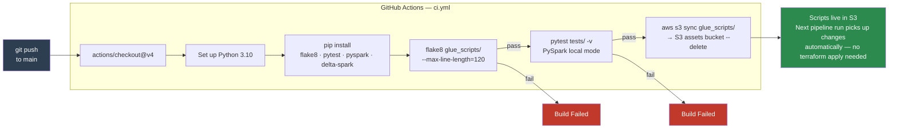

# CI/CD

## Overview

GitHub Actions automates linting, testing, and deployment of Glue scripts on every push to the `main` branch.

## Workflow



`.github/workflows/ci.yml`

```yaml
on:
  push:
    branches: [main]

jobs:
  ci:
    runs-on: ubuntu-latest
    steps:
      - uses: actions/checkout@v4

      - name: Set up Python
        uses: actions/setup-python@v5
        with:
          python-version: "3.10"

      - name: Install dependencies
        run: pip install flake8 pytest pyspark==3.3.* delta-spark

      - name: Lint
        run: flake8 glue_scripts/ --max-line-length=120

      - name: Unit tests
        run: pytest tests/ -v

      - name: Deploy scripts to S3
        run: |
          aws s3 sync glue_scripts/ s3://${{ secrets.ASSETS_BUCKET }}/scripts/ --delete
        env:
          AWS_ACCESS_KEY_ID: ${{ secrets.AWS_ACCESS_KEY_ID }}
          AWS_SECRET_ACCESS_KEY: ${{ secrets.AWS_SECRET_ACCESS_KEY }}
          AWS_DEFAULT_REGION: us-east-1
```

## Required GitHub Secrets

| Secret | Description |
|---|---|
| `AWS_ACCESS_KEY_ID` | IAM access key with `s3:PutObject` on the Glue assets bucket |
| `AWS_SECRET_ACCESS_KEY` | Corresponding secret key |
| `ASSETS_BUCKET` | Name of the Glue assets S3 bucket (output from Terraform) |

## What Each Step Does

**Lint** — `flake8` checks all PySpark scripts under `glue_scripts/` for style and syntax errors. Line length limit is relaxed to 120 to accommodate Spark method chaining.

**Unit tests** — `pytest` runs against `tests/` using PySpark in local mode (no cluster required). Tests cover:
- `delta_utils.py` helper functions
- Transformation logic for each Silver and Gold job (schema, dedup, SCD Type 2 hash, referential integrity filter)

**Deploy** — On a successful test run, all scripts are synced to the Glue assets S3 bucket. The `--delete` flag removes any scripts that were deleted from the repository. Glue jobs reference the S3 script path, so the updated scripts take effect on the next pipeline execution without requiring a Terraform apply.

## Optional: Deploy Step Function Definition

Add a second job to the workflow to upload the state machine template when it changes:

```yaml
  deploy-state-machine:
    needs: ci
    runs-on: ubuntu-latest
    if: contains(github.event.commits[*].modified, 'terraform/modules/step_functions/state_machine.json.tpl')
    steps:
      - uses: actions/checkout@v4
      - name: Upload state machine template
        run: |
          aws s3 cp terraform/modules/step_functions/state_machine.json.tpl \
            s3://${{ secrets.ASSETS_BUCKET }}/state_machine/state_machine.json.tpl
        env:
          AWS_ACCESS_KEY_ID: ${{ secrets.AWS_ACCESS_KEY_ID }}
          AWS_SECRET_ACCESS_KEY: ${{ secrets.AWS_SECRET_ACCESS_KEY }}
          AWS_DEFAULT_REGION: us-east-1
```
