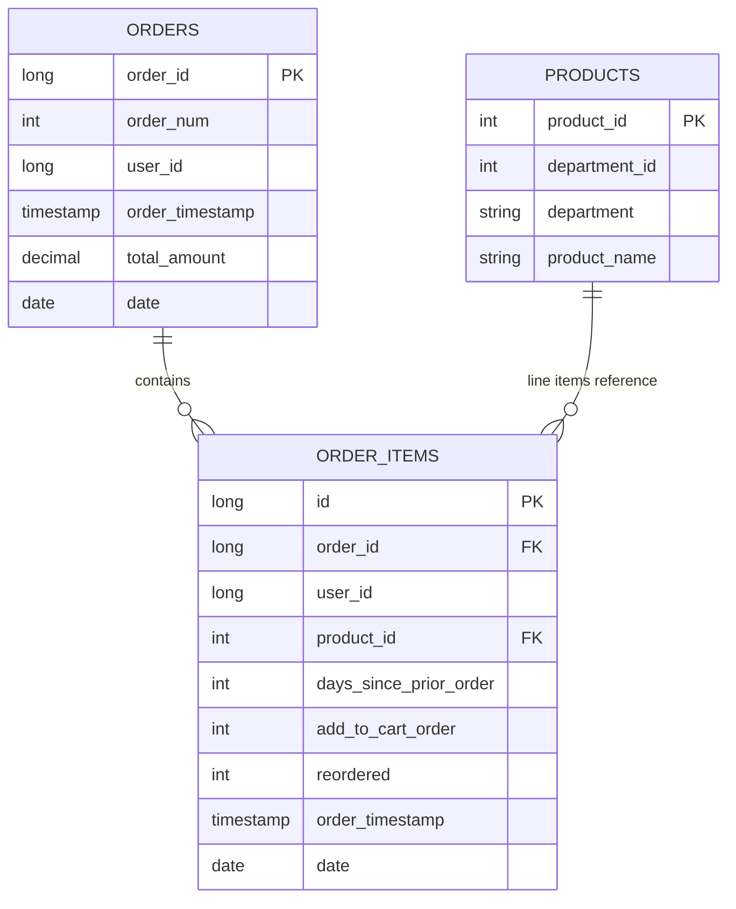
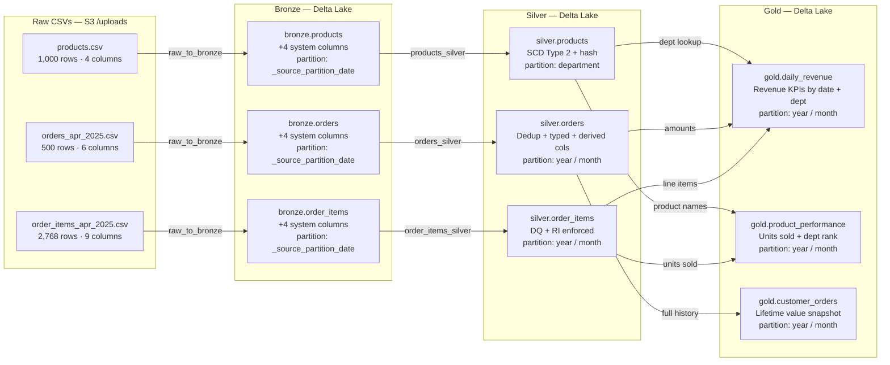

# Data Sources & Schemas

## Source Files

Three CSV files are dropped into `s3://<raw-bucket>/uploads/` to trigger the pipeline.

### products.csv

| Field | Type | Description |
|---|---|---|
| `product_id` | Integer | Primary key |
| `department_id` | Integer | Department foreign key |
| `department` | String | Department name |
| `product_name` | String | Product display name |

### orders_apr_2025.csv

| Field | Type | Description |
|---|---|---|
| `order_num` | Integer | Sequential order number |
| `order_id` | Long | Primary key |
| `user_id` | Long | Customer identifier |
| `order_timestamp` | Timestamp | Time of order placement |
| `total_amount` | Decimal(12,2) | Order total in USD |
| `date` | Date | Order date |

### order_items_apr_2025.csv

| Field | Type | Description |
|---|---|---|
| `id` | Long | Primary key |
| `order_id` | Long | Foreign key → orders |
| `user_id` | Long | Customer identifier |
| `days_since_prior_order` | Integer | Days since customer's previous order |
| `product_id` | Integer | Foreign key → products |
| `add_to_cart_order` | Integer | Position item was added to cart |
| `reordered` | Integer | 1 if previously purchased, 0 otherwise |
| `order_timestamp` | Timestamp | Time of order |
| `date` | Date | Order date |

---

## Data Lineage

---

## Bronze Schemas

Raw source columns are preserved as-is. The following system metadata columns are added by `raw_to_bronze.py`:

| Column | Type | Description |
|---|---|---|
| `_ingestion_timestamp` | Timestamp | When the row was written to Bronze |
| `_source_file` | String | S3 path of the source CSV |
| `_source_partition_date` | Date | Partition key |
| `_job_run_id` | String | Glue job run ID for lineage |

All Bronze tables are partitioned by `_source_partition_date`.

---

## Silver Schemas

### silver.products

| Column | Type | Notes |
|---|---|---|
| `product_id` | Integer | Primary key |
| `department_id` | Integer | |
| `department` | String | Partition key |
| `product_name` | String | |
| `valid_from` | Timestamp | SCD Type 2 — record effective start |
| `valid_to` | Timestamp | SCD Type 2 — record effective end (null = current) |
| `is_current` | Boolean | SCD Type 2 — true for the active record |
| `_record_hash` | String | SHA-256 of mutable attributes; change detection |
| `_silver_timestamp` | Timestamp | When the Silver record was written |

Partitioned by `department`.

### silver.orders

| Column | Type | Notes |
|---|---|---|
| `order_id` | Long | Primary key |
| `order_num` | Integer | |
| `user_id` | Long | |
| `order_timestamp` | Timestamp | |
| `total_amount` | Decimal(12,2) | |
| `order_date` | Date | |
| `order_year` | Integer | Derived — partition key |
| `order_month` | Integer | Derived — partition key |
| `day_of_week` | String | Derived |
| `_silver_timestamp` | Timestamp | |

Partitioned by `order_year`, `order_month`.

### silver.order_items

| Column | Type | Notes |
|---|---|---|
| `id` | Long | Primary key |
| `order_id` | Long | Foreign key → orders |
| `user_id` | Long | |
| `product_id` | Integer | Foreign key → products (referential integrity enforced) |
| `add_to_cart_order` | Integer | |
| `is_reordered` | Boolean | Cast from raw integer |
| `order_year` | Integer | Derived — partition key |
| `order_month` | Integer | Derived — partition key |
| `_silver_timestamp` | Timestamp | |

Partitioned by `order_year`, `order_month`.

---

## Gold Schemas

### gold.daily_revenue

| Column | Type | Description |
|---|---|---|
| `order_date` | Date | Natural key |
| `department` | String | Natural key |
| `order_count` | Long | Total orders |
| `unique_customers` | Long | Distinct user_ids |
| `gross_revenue` | Decimal(18,2) | Sum of total_amount |
| `avg_order_value` | Decimal(18,2) | gross_revenue / order_count |
| `order_year` | Integer | Partition key |
| `order_month` | Integer | Partition key |
| `_gold_timestamp` | Timestamp | When the Gold record was written |

### gold.product_performance

| Column | Type | Description |
|---|---|---|
| `product_id` | Integer | Natural key |
| `product_name` | String | |
| `department` | String | |
| `order_year` | Integer | Natural key / partition key |
| `order_month` | Integer | Natural key / partition key |
| `units_sold` | Long | Total quantity sold |
| `order_count` | Long | Distinct orders containing the product |
| `dept_revenue_rank` | Integer | Rank within department by units_sold |
| `reorder_rate` | Double | Fraction of orders where is_reordered = 1 |
| `_gold_timestamp` | Timestamp | |

### gold.customer_orders

| Column | Type | Description |
|---|---|---|
| `user_id` | Long | Natural key |
| `total_orders` | Long | Lifetime order count |
| `total_spend` | Decimal(18,2) | Lifetime spend |
| `avg_order_value` | Decimal(18,2) | |
| `avg_days_between_orders` | Double | Computed with lag window |
| `first_order_date` | Date | |
| `last_order_date` | Date | |
| `snapshot_year` | Integer | Partition key |
| `snapshot_month` | Integer | Partition key |
| `_gold_timestamp` | Timestamp | |
