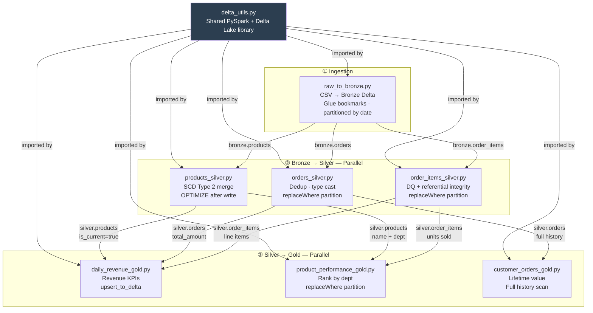

# Glue Job Scripts

All scripts live under `glue_scripts/` and are uploaded to the Glue assets S3 bucket during deployment. The shared utility library is packaged as `utils.zip` and attached to every job.

## Script Dependency Graph

---

## utils/delta_utils.py

Shared helpers imported by all jobs. Provides a consistent interface for SparkSession creation and all Delta Lake read/write operations.

| Function | Description |
|---|---|
| `get_spark_session(app_name)` | Creates a Delta-configured SparkSession with Glue context and Delta Lake extensions enabled |
| `table_exists(spark, path)` | Returns `True` if a Delta table exists at the given S3 path |
| `append_to_delta(df, path, partition_cols)` | Appends a DataFrame to a Delta table; creates the table on first run |
| `upsert_to_delta(df, path, merge_keys, partition_cols)` | Merge-based upsert; creates the table if it does not exist |
| `overwrite_partition(df, path, partition_cols, replace_where)` | Idempotent partition overwrite using Delta's `replaceWhere` predicate |
| `optimize_table(spark, path, zorder_cols)` | Runs `OPTIMIZE` on a Delta table, optionally with `ZORDER BY` to co-locate related data and reduce Athena scan costs |
| `vacuum_table(spark, path, retention_hours)` | Removes Delta versions older than the retention window (default 168h / 7 days) |
| `get_table_version(spark, path)` | Returns the current Delta table version number for audit logging |
| `register_table_in_catalog(spark, db, table, path)` | Registers a Delta table in the Glue Data Catalog using the Glue context |

---

## ingestion/raw_to_bronze.py

**Layer:** Raw → Bronze

Reads the three source CSVs from `s3://raw/uploads/` using Glue job bookmarks to skip files already processed. For each dataset it:

1. Infers schema from CSV headers
2. Adds four system metadata columns: `_ingestion_timestamp`, `_source_file`, `_source_partition_date`, `_job_run_id`
3. Appends to Bronze Delta tables partitioned by `_source_partition_date`

Bookmarks ensure the job is fully idempotent — re-running after a failure will not duplicate records.

---

## bronze_to_silver/products_silver.py

**Layer:** Bronze → Silver (SCD Type 2)

Implements a slowly-changing dimension for the product catalog:

1. Computes a SHA-256 hash of the four mutable product attributes (`department_id`, `department`, `product_name`, `product_id`)
2. Reads current Silver records and compares hashes
3. For changed records: sets `valid_to = current_timestamp`, `is_current = false` on the old row
4. Inserts new rows with `valid_from = current_timestamp`, `valid_to = null`, `is_current = true`
5. Unchanged records are not touched

Partitioned by `department`. OPTIMIZE runs after each write (no ZORDER on first run when column stats are absent).

---

## bronze_to_silver/orders_silver.py

**Layer:** Bronze → Silver

1. Casts all raw string columns to typed schemas: `order_id` → `LongType`, `total_amount` → `DecimalType(12,2)`, `order_timestamp` → `TimestampType`
2. Drops rows where `order_id` is null
3. Deduplicates on `order_id` using a `row_number()` window ordered by `_ingestion_timestamp DESC` — keeps the most recent ingestion for each order
4. Derives `order_year`, `order_month`, and `day_of_week` from `order_timestamp`
5. Writes via `overwrite_partition` with `replaceWhere = "order_year = {y} AND order_month = {m}"` — idempotent for the current partition

OPTIMIZE + ZORDER BY (`order_date`, `user_id`) to optimise Athena range and point-lookup queries.

---

## bronze_to_silver/order_items_silver.py

**Layer:** Bronze → Silver

1. Casts and validates all columns; drops rows with null `id` or `order_id`
2. Joins against the Silver products table and drops any `order_items` rows whose `product_id` has no matching current Silver product (referential integrity)
3. Casts `reordered` integer to `BooleanType` as `is_reordered`
4. Derives `order_year` and `order_month`
5. Writes via `overwrite_partition` — idempotent per year/month partition

OPTIMIZE + ZORDER BY (`order_id`, `product_id`).

---

## silver_to_gold/daily_revenue_gold.py

**Layer:** Silver → Gold

1. Reads Silver `order_items` for the current execution month
2. Joins with Silver `products` (current records only: `is_current = true`) to resolve `department` per line item
3. Joins with Silver `orders` to get `total_amount` per order
4. Groups by `order_date`, `department` and aggregates:
   - `order_count` — `COUNT(DISTINCT order_id)`
   - `unique_customers` — `COUNT(DISTINCT user_id)`
   - `gross_revenue` — `SUM(total_amount)`
   - `avg_order_value` — `gross_revenue / order_count`
5. Upserts into Gold on the natural key (`order_date`, `department`) using `upsert_to_delta`

OPTIMIZE + ZORDER BY (`order_date`, `department`).

---

## silver_to_gold/product_performance_gold.py

**Layer:** Silver → Gold

1. Joins Silver `order_items` with Silver `products` for department and product name
2. Groups by `product_id`, `product_name`, `department`, `order_year`, `order_month`
3. Aggregates `units_sold`, `order_count`, and `reorder_rate` (fraction where `is_reordered = true`)
4. Applies a `RANK()` window function partitioned by `department` and ordered by `units_sold DESC` to produce `dept_revenue_rank`
5. Writes via `overwrite_partition` — idempotent per year/month

OPTIMIZE + ZORDER BY (`order_month`, `department`, `dept_revenue_rank`).

---

## silver_to_gold/customer_orders_gold.py

**Layer:** Silver → Gold (cumulative snapshot)

Reads the full Silver `orders` history (not just the current month) because lifetime value is cumulative:

1. Computes `avg_days_between_orders` using a `LAG(order_date)` window per `user_id` ordered by `order_timestamp`
2. Groups by `user_id` and aggregates `total_orders`, `total_spend`, `avg_order_value`, `avg_days_between_orders`, `first_order_date`, `last_order_date`
3. Stamps the current `snapshot_year` and `snapshot_month` for point-in-time comparisons
4. Writes via `overwrite_partition` — each monthly snapshot is idempotent

OPTIMIZE + ZORDER BY (`total_spend`, `total_orders`).
