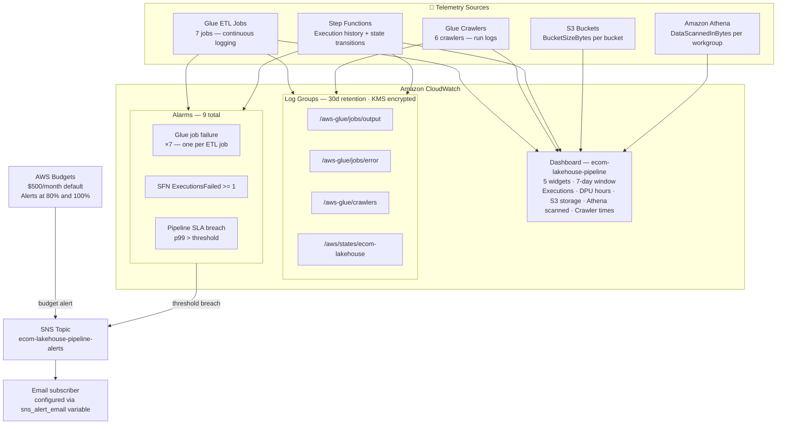

# Monitoring & Cost

## Observability Stack

---

## CloudWatch Dashboard

A single dashboard (`ecom-lakehouse-pipeline`) with five widgets:

| Widget | Metric | Window |
|---|---|---|
| Pipeline executions | Step Functions `ExecutionsStarted` / `ExecutionsSucceeded` / `ExecutionsFailed` | Last 7 days |
| Glue DPU hours | Per-job `glue.driver.ExecutorRunTime` | Last 7 days |
| S3 storage | `BucketSizeBytes` per bucket | Last 7 days |
| Athena data scanned | `DataScannedInBytes` per workgroup | Last 7 days |
| Crawler run times | Crawler `ElapsedTime` | Last 7 days |

## Alarms

| Alarm | Metric | Condition | Action |
|---|---|---|---|
| Glue job failure (×7) | `glue.driver.aggregate.numFailedTasks` per job | >= 1 | SNS alert |
| Pipeline SLA breach | Step Functions p99 `ExecutionTime` | > configurable threshold | SNS alert |
| Pipeline execution failure | Step Functions `ExecutionsFailed` | >= 1 | SNS alert |

All alarms publish to the `ecom-lakehouse-pipeline-alerts` SNS topic. Subscribe an email address via the `sns_alert_email` Terraform variable.

## CloudWatch Log Groups

| Log Group | Retention | Source |
|---|---|---|
| `/aws-glue/jobs/output` | 30 days | Glue job stdout |
| `/aws-glue/jobs/error` | 30 days | Glue job stderr |
| `/aws-glue/crawlers` | 30 days | Crawler run logs |
| `/aws/states/ecom-lakehouse` | 30 days | Step Functions execution history |

All log groups are encrypted with the project KMS CMK.

## Cost Controls

**Athena scan limits**

| Workgroup | Max bytes per query |
|---|---|
| `primary` (analysts) | 10 GB |
| `engineering` | 50 GB |

Queries that would exceed the limit are cancelled before execution.

**S3 lifecycle policies**

| Bucket | Rule |
|---|---|
| Raw | Objects → S3 Infrequent Access at 30 days → S3 Glacier at 90 days |
| Lakehouse (Bronze) | Objects → S3 Intelligent-Tiering |
| Athena results | Objects expire (deleted) after 7 days |

**Delta OPTIMIZE + ZORDER**

All Gold and Silver tables are compacted and Z-ordered after each write. This reduces the number of files Athena must scan by co-locating frequently queried columns, typically cutting Athena costs by 40–70% compared to unoptimised Delta tables.

**AWS Budgets**

A monthly budget is created with the `monthly_budget_usd` variable (default $500). Email notifications are sent at 80% and 100% of the threshold.
