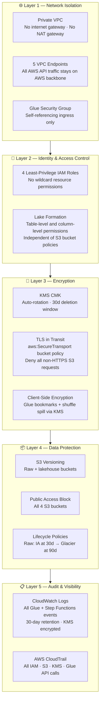

# Security

## Defense-in-Depth Overview



---

## Encryption at Rest

| Resource | Mechanism |
|---|---|
| S3 lakehouse bucket | KMS CMK (`aws:kms`) |
| S3 raw bucket | AES-256 (SSE-S3) — lower latency for landing zone |
| S3 Glue assets & Athena results buckets | KMS CMK |
| Glue job bookmarks | CSE-KMS (client-side encryption) |
| Glue shuffle data (Spark spill) | KMS CMK |
| CloudWatch Logs (all log groups) | KMS CMK |
| SNS alert topic | KMS CMK |
| Step Functions execution history | KMS CMK |

The CMK is defined in the `kms` module with automatic annual rotation and a 30-day scheduled deletion window.

## Encryption in Transit

All S3 buckets enforce TLS via a bucket policy condition:

```json
{
  "Condition": { "Bool": { "aws:SecureTransport": "false" } },
  "Effect": "Deny",
  "Action": "s3:*"
}
```

All Glue job traffic to AWS service APIs (S3, Glue Catalog, KMS, CloudWatch, Step Functions) is routed through VPC Interface Endpoints — no traffic leaves the AWS network.

## Network Isolation

Glue jobs run inside private VPC subnets with no internet gateway or NAT gateway. All AWS API calls are made via VPC endpoints. The Glue security group allows only self-referencing ingress so Glue worker nodes can communicate within a job cluster, with no inbound access from outside.

## IAM Least Privilege

Four separate roles — Glue execution, Glue crawler, Step Functions, and Lake Formation — each scoped to the minimum permissions required. No role has `*` resource wildcards on sensitive actions. Roles cannot modify IAM policies or governance settings.

## Data Governance

AWS Lake Formation enforces permissions at the database and table level, independent of S3 bucket policies. The Glue execution role has `SELECT / INSERT / DELETE / ALTER / DESCRIBE` on all tables. The crawler role has `SELECT / ALTER / DESCRIBE` on Bronze and Silver only. Neither role can modify Lake Formation settings.

## Audit Trail

CloudWatch Logs captures all Glue job runs, crawler executions, and Step Functions state transitions. AWS CloudTrail (account-level) records all API calls for IAM, S3, KMS, Glue, and Step Functions.
