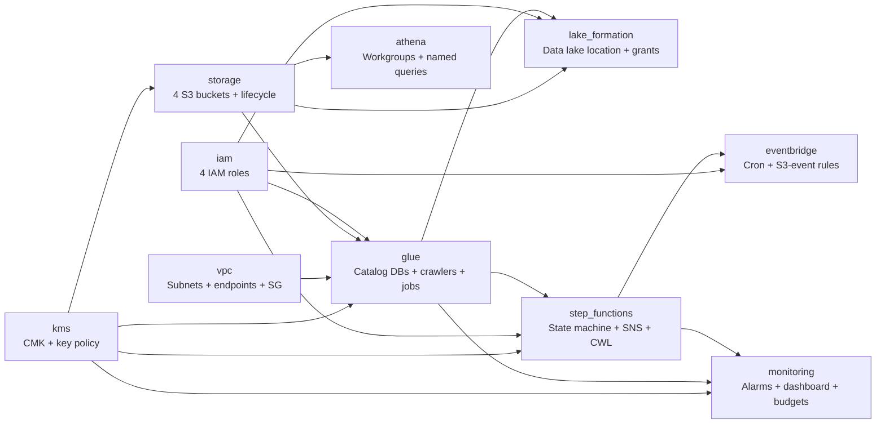
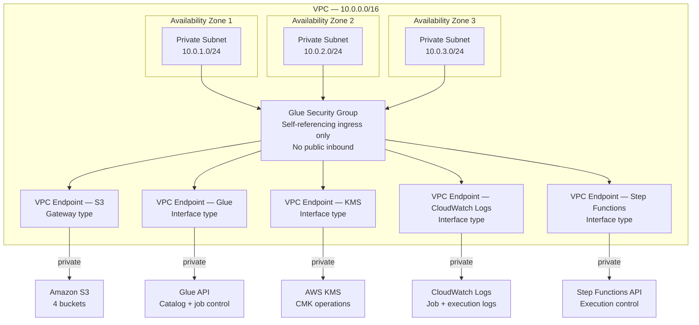

# Terraform Modules

All infrastructure is provisioned through 10 modules wired together in `terraform/main.tf`. Remote state is stored in S3 with DynamoDB locking (`terraform/backend.tf`).

## Module Dependency Graph

---

## vpc

Private subnets across 3 AZs (`10.0.1.0/24`, `10.0.2.0/24`, `10.0.3.0/24`). A Glue-dedicated security group with self-referencing ingress rules ensures Glue workers can communicate within the cluster. Five VPC endpoints provide private AWS API access:

| Endpoint | Type |
|---|---|
| S3 | Gateway |
| Glue | Interface |
| KMS | Interface |
| CloudWatch Logs | Interface |
| Step Functions | Interface |

---

## kms

A single customer-managed key (CMK) with automatic rotation enabled and a 30-day deletion window. The key policy grants `kms:GenerateDataKey` and `kms:Decrypt` to the S3, Glue, CloudWatch Logs, and Step Functions service principals within the account.

---

## storage

Four S3 buckets — all with public access blocked and TLS-only (`aws:SecureTransport`) bucket policies.

| Bucket | Versioning | Encryption | Lifecycle |
|---|---|---|---|
| `ecom-lakehouse-raw-{account}` | Enabled | AES-256 | → IA at 30d → Glacier at 90d |
| `ecom-lakehouse-lakehouse-{account}` | Enabled | KMS CMK | Bronze → S3 Intelligent-Tiering |
| `ecom-lakehouse-glue-assets-{account}` | Disabled | KMS CMK | — |
| `ecom-lakehouse-athena-results-{account}` | Disabled | KMS CMK | Expire objects after 7d |

The raw bucket has EventBridge notifications enabled so that S3 Object Created events can start the pipeline automatically.

---

## iam

Four least-privilege IAM roles:

**Glue Execution Role** — used by all ETL jobs
- S3: read `raw` bucket, read/write `lakehouse` and `glue-assets` buckets
- KMS: `Decrypt`, `GenerateDataKey`, `DescribeKey`
- Glue Data Catalog: get/create/update databases, tables, partitions
- CloudWatch Logs: create log groups/streams, put log events
- CloudWatch Metrics: `PutMetricData` scoped to the `ecom-lakehouse/GlueJobs` namespace
- VPC: describe and create network interfaces — provided by the attached `AWSGlueServiceRole` managed policy

**Glue Crawler Role** — used by all crawlers
- S3: read-only on `lakehouse` bucket (`GetObject`, `ListBucket`)
- Glue Data Catalog: create/update/delete tables and partitions across all three layer databases
- KMS, CloudWatch Logs, VPC: same as above (shares the same custom policies as the execution role)
- `AWSGlueServiceRole` managed policy also attached

**Step Functions Role** — used by the state machine
- Glue jobs: `StartJobRun`, `GetJobRun`, `GetJobRuns`, `BatchStopJobRun`
- Glue crawlers: `StartCrawler`, `GetCrawler`, `StopCrawler`
- CloudWatch Logs: full log-delivery API (`CreateLogDelivery`, `ListLogDeliveries`, etc.)
- SNS: `Publish` to the alert topic

**Lake Formation Admin Role** — used for resource registration
- S3: read-only on `lakehouse` bucket (`GetObject`, `ListBucket`, `GetBucketLocation`) — sufficient to register the data lake location

---

## glue

**Glue Data Catalog databases**

| Database | S3 Location |
|---|---|
| `ecom-lakehouse_bronze` | `s3://lakehouse/bronze/` |
| `ecom-lakehouse_silver` | `s3://lakehouse/silver/` |
| `ecom-lakehouse_gold` | `s3://lakehouse/gold/` |

**Glue Crawlers** (6 total)

| Crawler | Targets | Schedule | Schema Change Policy |
|---|---|---|---|
| `bronze-products` | `s3://lakehouse/bronze/products/` | Hourly | UPDATE_IN_DATABASE |
| `bronze-orders` | `s3://lakehouse/bronze/orders/` | Hourly | UPDATE_IN_DATABASE |
| `bronze-order-items` | `s3://lakehouse/bronze/order_items/` | Hourly | UPDATE_IN_DATABASE |
| `silver-products` | `s3://lakehouse/silver/products/` | Daily 07:00 UTC | LOG |
| `silver-orders` | `s3://lakehouse/silver/orders/` | Daily 07:00 UTC | LOG |
| `silver-order-items` | `s3://lakehouse/silver/order_items/` | Daily 07:00 UTC | LOG |

All crawlers use Delta Lake native mode with manifest write disabled.

**Glue ETL Jobs** (7 total — Glue 4.0, PySpark 3.3, Delta Lake extensions)

| Job | Layer | Worker Type | Workers |
|---|---|---|---|
| `raw_to_bronze` | Raw → Bronze | G.1X | 2 |
| `products_silver` | Bronze → Silver | G.1X | 2 |
| `orders_silver` | Bronze → Silver | G.1X | 2 |
| `order_items_silver` | Bronze → Silver | G.1X | 2 |
| `daily_revenue_gold` | Silver → Gold | G.1X | 2 |
| `product_performance_gold` | Silver → Gold | G.1X | 2 |
| `customer_orders_gold` | Silver → Gold | G.1X | 2 |

All jobs are configured with:
- Glue job bookmarks (idempotency)
- Continuous CloudWatch logging
- Glue job insights and metrics
- Glue security configuration (KMS for bookmarks, shuffle, and CloudWatch)
- VPC connection routing traffic through private subnets

---

## step_functions

A Standard Workflow state machine rendered from `modules/step_functions/state_machine.json.tpl`. Terraform injects Glue job ARNs and the SNS topic ARN at apply time.

- Execution history is logged to `/aws/states/ecom-lakehouse` (30-day retention, KMS encrypted)
- An SNS alert topic (`ecom-lakehouse-pipeline-alerts`) is created with KMS encryption
- Every task state has `HeartbeatSeconds`, `TimeoutSeconds`, retry with exponential backoff, and a `Catch` block pointing to `NotifyFailure`

---

## eventbridge

Two rules targeting the Step Functions state machine:

| Rule | Trigger | Input |
|---|---|---|
| Daily schedule | `cron(0 6 * * ? *)` | `{"execution_date": "<date>"}` |
| S3 upload | Object Created in `uploads/` prefix of raw bucket | `{"execution_date": "<date>"}` |

Both rules use an EventBridge IAM role with `states:StartExecution` scoped to the state machine ARN.

---

## lake_formation

- Registers `s3://lakehouse/` as a Lake Formation data lake location using the LF admin role
- Sets the Glue execution role and LF admin role as data lake administrators
- Grants database-level permissions:
  - Glue execution role: `ALL` on bronze, silver, gold databases
  - Glue crawler role: `DESCRIBE` + `CREATE_TABLE` on bronze and silver databases
- Grants table-level permissions:
  - Glue execution role: `SELECT`, `INSERT`, `DELETE`, `ALTER`, `DESCRIBE` on all tables
  - Glue crawler role: `SELECT`, `ALTER`, `DESCRIBE` on Bronze and Silver tables

---

## athena

| Workgroup | Audience | Scan Limit |
|---|---|---|
| `primary` | Analysts | 10 GB per query |
| `engineering` | Data engineers | 50 GB per query |

Results are written to `s3://athena-results/` with KMS encryption. Four named queries are pre-loaded (see [athena-queries.md](athena-queries.md)).

---

## monitoring

- **CloudWatch Log Groups** — `/aws-glue/jobs/` and `/aws-glue/crawlers/` (30-day retention)
- **CloudWatch Alarms**:
  - Per-job failure alarm for each of the 7 Glue jobs
  - Pipeline SLA breach (p99 execution time > configurable threshold)
  - Step Functions `ExecutionsFailed` metric alarm
- **CloudWatch Dashboard** — 5 widgets: pipeline executions (7d), Glue DPU hours, S3 storage per bucket, Athena data scanned per workgroup
- **AWS Budgets** — monthly ceiling (`monthly_budget_usd` variable, default $500) with SNS alerts at 80% and 100%
